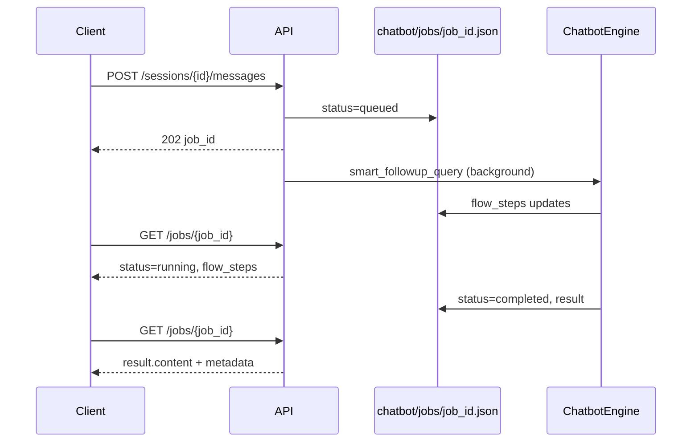

# Chatbot async jobs

The chatbot engine can run 30 seconds to several minutes (deep research, large CSV fetches). All message endpoints return **HTTP 202** immediately and process in a background thread pool.

## Flow



## Poll interval

Poll every **2–5 seconds**. Stop when `status` is `completed` or `failed`.

Maximum wait: `deep_research_total_timeout_seconds` from `GET /config` limits (plus buffer for data fetch).

## Example (bash)

```bash
BASE=http://51.20.53.218:8506/api/v1/chatbot

# Create session
SID=$(curl -s -X POST "$BASE/sessions" -H "Content-Type: application/json" -d '{}' | jq -r .session_id)

# Enqueue message
JOB=$(curl -s -X POST "$BASE/sessions/$SID/messages" \
  -H "Content-Type: application/json" \
  -d '{"message":"Summarize open AAPL signals","preset":"freeform"}')
JOB_ID=$(echo "$JOB" | jq -r .job_id)

# Poll
while true; do
  STATUS=$(curl -s "$BASE/jobs/$JOB_ID" | jq -r .status)
  echo "status=$STATUS"
  if [ "$STATUS" = "completed" ] || [ "$STATUS" = "failed" ]; then
    curl -s "$BASE/jobs/$JOB_ID" | jq .
    break
  fi
  sleep 3
done
```

## Job object fields

| Field | When set |
|-------|----------|
| `flow_steps` | During `running` — pipeline progress (router, web search, synthesis) |
| `result.content` | On `completed` — assistant markdown answer |
| `result.metadata` | On `completed` — route, signal tables, tokens, deep research log path |
| `error` | On `failed` — exception message |

## Workers

Configure parallel jobs with env `CHATBOT_JOB_WORKERS` (default `2`). Job files persist under `chatbot/jobs/` (`CHATBOT_JOBS_DIR`).
